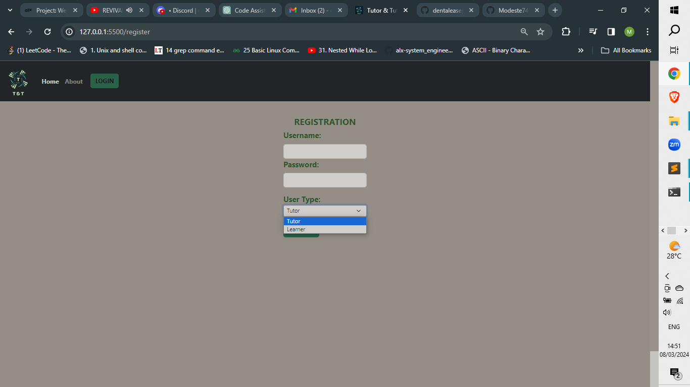
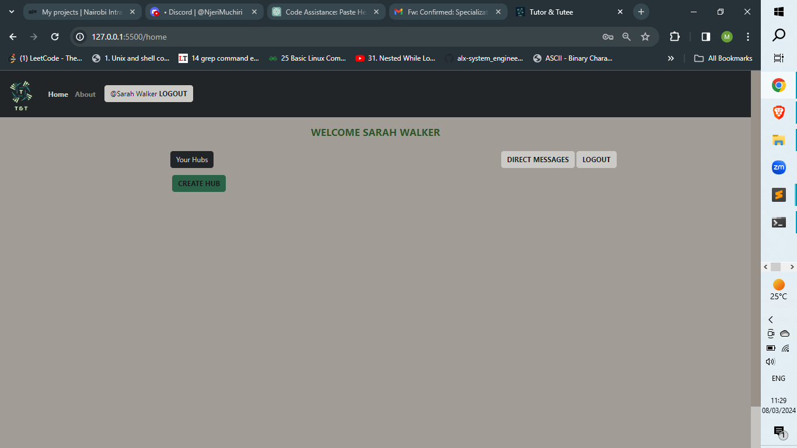

<h1>T&T portfolio project</h1>
<h2>Final project for the alx specilization</h2>

Together with my teammate, Ann Muchiri, we are going to build a website that will facilitate the tutoring of learners.

This is how the product looks like and works

<h1>T & T</h1>

T & T is web application designed to help tutors host learning with different groups of learners depending on whats being offered. The goal is to create a segregated environment for tutors to host the learners for purpose fo teaching and learning.

<h1>Key Objectives</h1>
<ul>
	<li>Allow for the creation of hubs by tutors.</li>
	<li>Allow for the additon of learners into the hubs.</li>
	<li>Allow for the creation of groups in the hubs.</li>
	<li>Allow the displaying and access the group that the learners are in.</li>
	<li>Allow for the sending of the resources by the tutor.</li>
	<li>Tutor can add participants to the different groups created.</li>
</ul>

<h1>Important Links</h1>
<a href="https://youtu.be/AWPagfHkvAc" target="_blank">Web App Demo</a> 

<h1>Features</h1>

The wep app allows the users to do the follwoing functions in regards to streamlining his operations:

<ul>
<li>Tutor Hub Creation and Learner Addition: 

A user who is of user_type 'tutor' can create a learning hub and add the different learners that are present in the database.

 
</li>
</li>

<li>Tutor Group Creation and Learner addition:

Similar to the hub creation the tutor has the ability to create groups inside the hubs and add participants to the different groups.

 
</li>
</li>
<li>Tutor can send Resources to a hub:

The tutor is the only user allowed to send the messages on the resouce chat. The learner can only view.

 
</li>
</li>
<li>Tutor and learner chat room:

Both the tutor and the learner have the ability to access the hub chat room. From there they can send and view messages from other hub occupants.

 
</li>
<li>Tutor and learner group chat:

Both the tutor and the learner have the ability to access the group chat room. From there they can send and view messages from other group occupants. But the view from the tutor is different as the button for adding the new group participants is only accessible for him/her.

 
</li>
</ul>
</li>
</ul>

<h3>Usage:</h3>

The site is meant for multiple users with two user types. Either a learner or a tutor. If user doesn't have account they register.

 

 

 

	Once one has successfully logged in they'll have access to the home page which is different to the learner and tutor. The tutor has the ability to create a hub from the home page.

 

 
